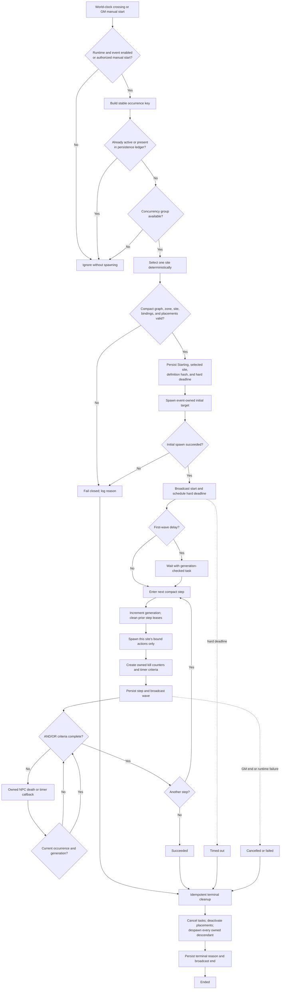
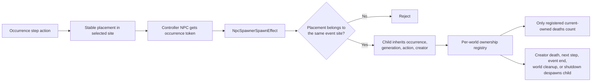
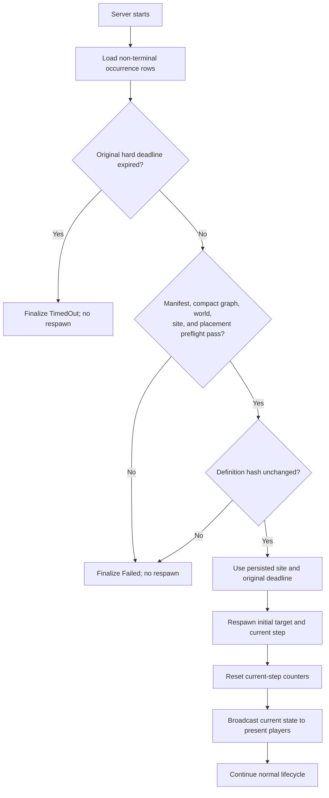

# Tower-Defense Rifts Flowchart and Test Runbook

This is the implemented lifecycle for Crimson Rift, Grimghast Rift, and future manifest-defined tower-defense events. The subsystem and every retail schedule remain disabled by default. GM manual starts are allowed so the first deployment can be tested without enabling automatic schedules.

## Lifecycle flow

## Spawn ownership flow

## Restart reconciliation

## First in-game validation

Keel should deploy the committed image normally. Do not enable automatic schedules for the first pass. With a level-100 GM character, test one occurrence at a time:

1. Run `tower_def list` to review every loaded event, compact validity, schedule state, and available site key.
2. Run `tower_def start rift.crimson.cinderstone cinderstone-1`, travel to the announced marker, and verify exactly that Cinderstone cluster appears. Repeat later with `cinderstone-2` and `cinderstone-3`.
3. Run `tower_def next rift.crimson.cinderstone` to shorten each wait during smoke testing. Use `tower_def list` after each transition.
4. Run `tower_def end rift.crimson.cinderstone smoke_test` and verify the marker, controllers, waves, and descendants all disappear.
5. Repeat for both Ynystere sites, the Auroria site, `rift.grimghast.cinderstone`, and `rift.grimghast.ynystere`.
6. For each Grimghast combat event, verify wave counts are 30, 30, and 2 and that no formation spawns twice.
7. Test the notices with `rift.grimghast.cinderstone.notice` and `rift.grimghast.ynystere.notice`.
8. During one active combat step, relog and cross a zone boundary; the active marker and current wave must be restored.
9. For the restart test only, set the global tower-defense runtime to enabled while leaving every event manifest schedule disabled. During an active step, let Keel restart the pod. The same site and original deadline must recover without duplicating NPCs. With the global runtime disabled, persisted occurrences are deliberately finalized instead of resumed.

The six missing Grimghast formation groups use the approved custom re-authoring path: exact compact objective templates/counts with reviewed formation grids around the existing region anchors. They are intentionally labeled custom, not retail-exact, until an authoritative r208022 placement export or packet capture replaces them.

## Future custom events

Add one or more manifest files under `Content/projects/custom/tower-defense/`. Content Studio validates required event fields, rejects duplicate event keys, includes source hashes in its build manifest, and emits a separate `tower-defense.<project>.json` runtime bundle. The game server loads every non-schema JSON manifest in `Data/TowerDefense`, so adding a reviewed bundle does not require event-specific server code.

Compact rows and referenced assets continue to use the existing Content Studio records/raw-SQL and ID-registry paths. World placements remain stable `npc_spawns*.json` overlays with `StartInactive`, `EventPlacementId`, and `EventSiteKey` metadata.
